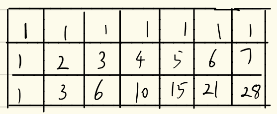

## 062. 不同路径 - [动态规划 【简单】+ 纯数学排列组合]

### [Problem Link](https://leetcode-cn.com/problems/unique-paths/)
	一个机器人位于一个 m x n 网格的左上角 （起始点在下图中标记为“Start” ）。
	机器人每次只能向下或者向右移动一步。机器人试图达到网格的右下角（在下图中标记为“Finish”）。
	问总共有多少条不同的路径？

### Example:


例如，上图是一个7 x 3 的网格。有多少可能的路径？

## Solution
### My solution - 纯数学

组合数问题

```java
class Solution {
    public int uniquePaths(int m, int n) {
        int total_step = m + n - 2;
        int another_direction = Math.min(m, n) - 1;
        long result = 1;
        for(int i = total_step, j = another_direction; j > 0; i--, j--) 
        	result *= i;
        for(int i = another_direction; i > 0; i--)
        	result /= i;
        return (int)result;
    }
}
```
### My solution - 动态规划

```java
class Solution {
    public int uniquePaths(int m, int n) {
        int [][] dp = new int [m][n];
        for(int i=0;i<m;i++){
            for(int j=0;j<n;j++){
                if(i==0 || j==0)
                    dp[i][j] = 1;
                else
                    dp[i][j] = dp[i-1][j] + dp[i][j-1];
            }
        }
        return dp[m-1][n-1];
    }
}
```

### Notes



